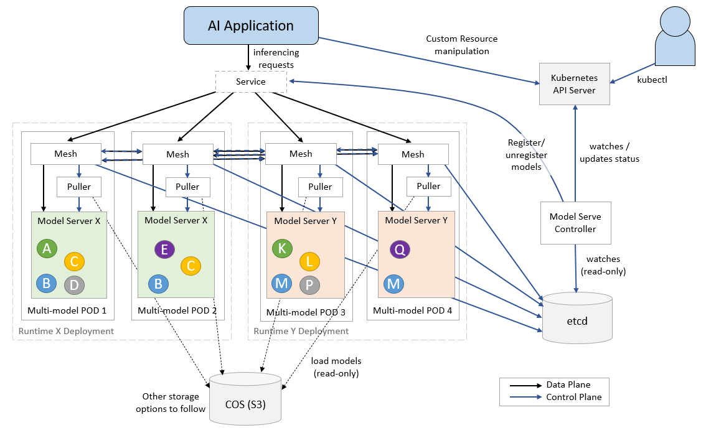
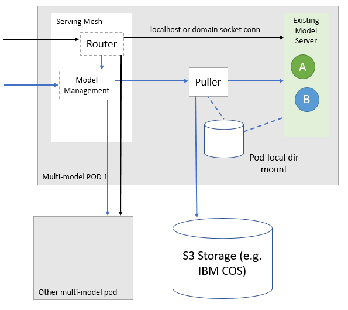
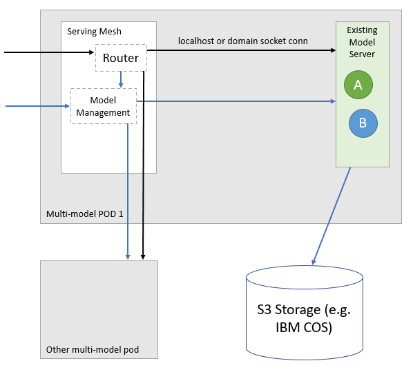
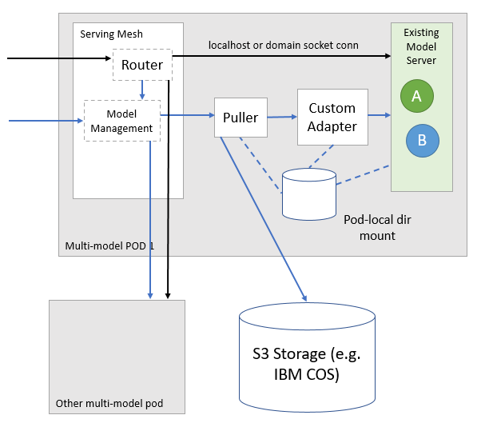
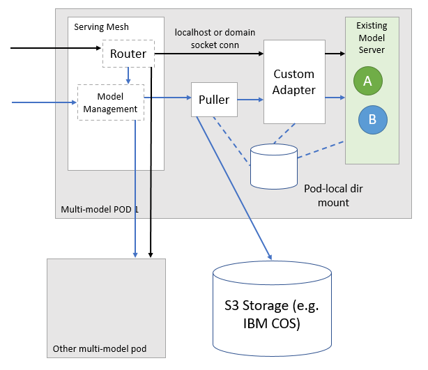
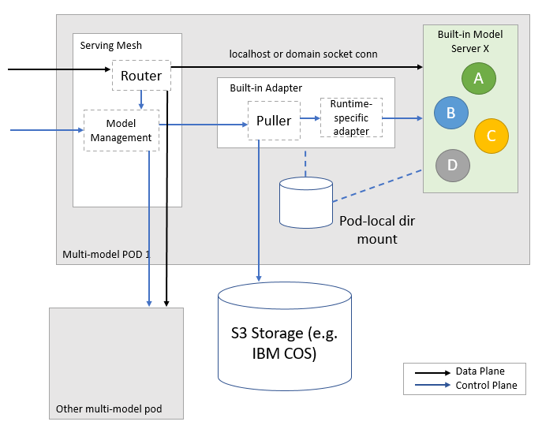

# Architecture Overview

The central component of ModelMesh Serving is a Kubernetes controller responsible for reconciling the `ServingRuntime` and `InferenceService` custom resource types.

### Serving Runtime Deployments

_Note: "Deployment" here is used primarily to refer to Kubernetes `Deployment`s as opposed to "model deployments"_

The controller maintains a separate Kubernetes `Deployment` for each defined `ServingRuntime` (excluding any with `disabled: true` set). The Pods of each of these Deployments comprise a model-mesh container, along with additional containers depending on the corresponding `ServingRuntime`'s Spec. The model-mesh containers across all Pods of all Deployments form a cluster within which both control and dataplane requests are routed.

The runtime-specific model server in each Pod is responsible for loading and serving models of one or more types, and is assumed to be capable of loading/serving multiple different models from memory concurrently. Model-mesh decides when/where copies of each model should be loaded, and instructs collocated model servers accordingly (possibly via puller and/or adapter containers, see below).

Currently, the number of Pods per runtime Deployment is set as a single global configuration parameter (defaults to 2). The resource allocations of the runtime-specific containers are statically defined within the `ServingRuntime` Spec. It's expected that both of these will become more dynamic in future updates however.

A single Kubernetes `Service` points to all Pods across all Deployments. External inferencing requests are made via this Service and the "ingress" model-mesh Pod routes them to the other Pods as needed.

### InferenceService

For each defined `InferenceService` predictor, the controller registers a "VModel" (virtual model) in model-mesh of the same name, as well as a concrete model whose name incorporates a hash of the `InferenceService`'s current predictor Spec. The VModel represents a stable endpoint which will resolve to the most recent successfully loaded concrete model. Logical CRUD operations on these model-mesh entities are performed via its gRPC-based model-management interface during `InferenceService` reconciliation.

A central etcd is used "internally" by the model-mesh cluster to keep track of active Pods, registered models/vmodels, and which models currently reside on which runtimes. Model-mesh does not currently provide a way of listening events when the state of its managed models/vmodels change, and so in a small violation of encapsulation the controller also watches model-mesh's internal datastructures in etcd directly, but in a read-only manner and just for the purpose of reacting to state change events. The status information subsequently returned by model-mesh's model management gRPC API requests is used by the controller to update `InferenceService`s' Statuses.

### Model Server Integration Options

The `ServingRuntime` construct provides some flexibility in how model servers are integrated into the platform.

#### The model puller

In most cases a "puller" container is included which is responsible for resolving and retrieving models from remote storage prior to making load requests to the runtime-specific container(s). This is injected by the controller and not specified explicitly in the `ServingRuntime`s. Models files are stored on a Pod-local `emptyDir` volume which is also mounted to all of the runtime-specific containers.

#### Purpose-built model server

If a model server can be built/tailored to conform to the model-mesh internal management API, it can be integrated directly.

#### Model server with direct storage access

For some use cases it's preferable to omit the puller and have the model server retrieve the data itself directly from remote storage. Currently, this is only possible when there is a single, statically-configured backing store for the models.

#### Custom integration of existing model server without extra data plane hop

Usually, it is possible to use an adapter for the control aspects only (loading/unload models), and avoid inferencing requests from having to pass through the adapter.

### Custom integration of existing model server with extra data plane hop

If this is not possible, the adapter can also be used to transform the data plane requests/responses as appropriate. Note that in the future we plan to incorporate more flexible inferencing graphs, including the ability to specify transcoding/transformations within the general routing layer.

#### Built-in runtimes

Our built-in runtimes use third-party model servers but inline the puller logic into our common provided adapter image, reducing the container footprint.

### Secrets and ConfigMaps used

See the page on [Secrets and ConfigMaps](secrets-and-cms.md).
