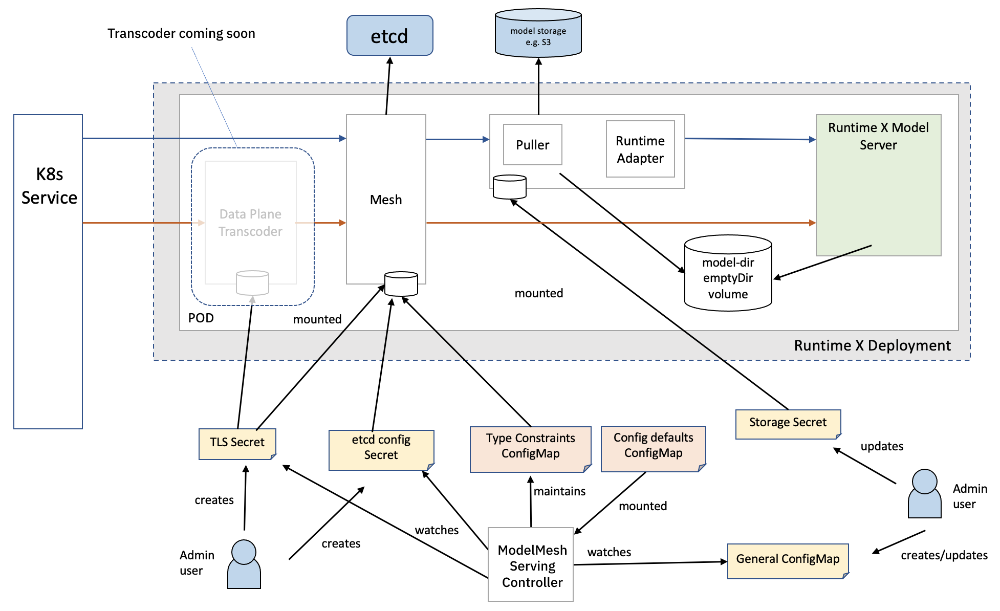

# Secrets and ConfigMaps

This page provides a summary of the various Secrets and ConfigMaps used in the system. Some of these are "internal" and used only as a means of sharing information between components, others are intended for admin users to update with behavioural preferences or details of how to connect to external dependencies.

### User Settable

|                                  | Type      | Default Name            | Name From                                           | Created By                                                     | Accessed By                       | More Detail                                                                 |
| -------------------------------- | --------- | ----------------------- | --------------------------------------------------- | -------------------------------------------------------------- | --------------------------------- | --------------------------------------------------------------------------- |
| General configuration parameters | ConfigMap | `model-serving-config`  |                                                     | User, defaults used otherwise                                  | Controller                        | [here](../configuration/)                                                   |
| etcd connection details          | Secret    | `model-serving-etcd`    | `ETCD_SECRET_NAME` env var on Controller Deployment | Install script (quickstart), User in the case of external etcd | Controller, model-mesh containers | [here](../install/install-script.md/#setup-the-etcd-connection-information) |
| TLS certificates                 | Secret    |                         | `tls.secretName` param in `model-serving-config` CM | User                                                           | Controller, model-mesh containers | `tls.*` parameters [here](../configuration)                                 |
| Storage location configurations  | Secret    | `model-serving-storage` | `storageSecretName` in `model-serving-config` CM    | Install script                                                 | Puller containers                 | [here](../predictors/setup-storage.md)                                      |

### Internal-Only

|                                     | Type      | Name                            | Created By     | Updated By                                                 | Accessed By           | More Detail                                                    |
| ----------------------------------- | --------- | ------------------------------- | -------------- | ---------------------------------------------------------- | --------------------- | -------------------------------------------------------------- |
| "Factory default" config parameters | ConfigMap | `model-serving-config-defaults` | Install script | Fixed for a given version, should not be modified manually | Controller            |                                                                |
| Internal Type Constraints config    | ConfigMap | `tc-config`                     | Controller     | Controller                                                 | Model-mesh containers | For propagating model type/placement information to model-mesh |
